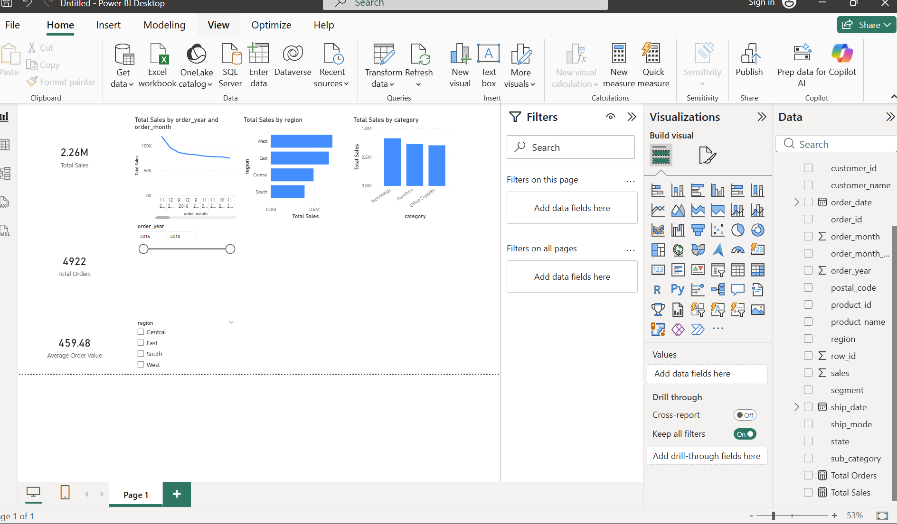
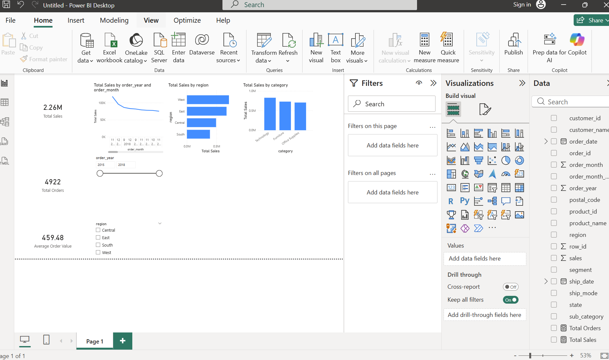

# retail-sales-data-analysis
End-to-end data analyst project using Python, SQL, and Power BI to analyze retail sales and generate business insights.
# 📊 Retail Sales Data Analysis (SQL + Power BI)

## 🔍 Project Overview
This project analyzes retail sales data to uncover trends, regional performance, and product category insights.  
The goal is to demonstrate **end-to-end data analytics skills** using Python, SQL, PostgreSQL, and Power BI.

---

## 🛠 Tools & Technologies
- **Python** (Pandas, NumPy) – Data cleaning & preprocessing
- **PostgreSQL** – Data storage & SQL analysis
- **SQL** – Aggregations, trend analysis, business insights
- **Power BI** – Interactive dashboard & visualization
- **GitHub** – Version control & project documentation

---

## 📂 Project Structure

---

## 🧹 Data Cleaning (Python)
- Converted date columns to proper datetime format
- Handled missing postal codes
- Standardized column names
- Created time-based features (year, month)

---

## 🗄 SQL Analysis (PostgreSQL)
Key analyses performed:
- Total sales and total orders
- Sales by region and category
- Monthly and yearly sales trends
- Top customers and products
- Average order value (AOV)

---

## 📈 Power BI Dashboard
The Power BI dashboard includes:
- **KPI Cards**: Total Sales, Total Orders, Avg Order Value
- **Monthly Sales Trend**
- **Sales by Region**
- **Sales by Category**
- **Interactive slicers** (Year, Region)

### Dashboard Preview

---

## 💡 Key Business Insights
- The **West and East regions** generate the highest revenue
- **Technology** is the top-performing category
- Sales show strong **year-over-year growth**
- Clear seasonality patterns in monthly sales

---

## 🚀 What This Project Demonstrates
- End-to-end analytics workflow
- Strong SQL querying skills
- Practical Power BI dashboard design
- Business-focused data storytelling

---

## 📌 Next Improvements
- Add profit analysis
- Customer segmentation
- Forecasting future sales

---

👤 **Author**: Keshore GJ  
📫 GitHub: https://github.com/kshgj
